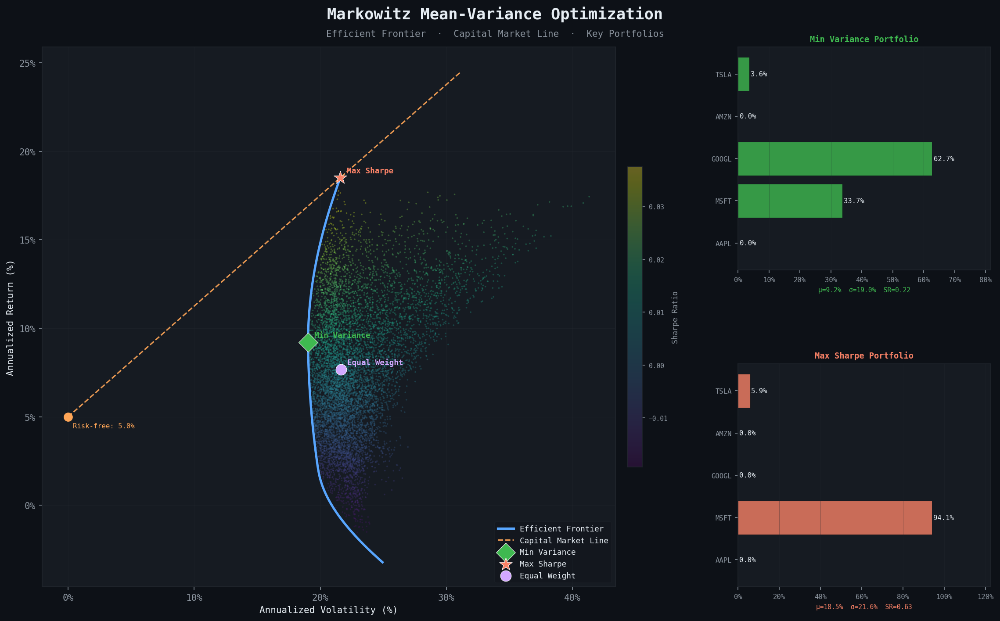

# Portfolio Optimization — Markowitz Mean-Variance Theory

> A clean Python implementation of **Markowitz portfolio optimization** 



---

## Mathematical Foundation

### 1. Setup

We have $n$ risky assets. Over $T$ periods we observe returns matrix $R \in \mathbb{R}^{T \times n}$.

From the data we estimate:

$$\mu = \frac{1}{T} R^\top \mathbf{1} \in \mathbb{R}^n \qquad \text{(expected returns)}$$

$$\Sigma = \frac{1}{T-1}(R - \mathbf{1}\mu^\top)^\top(R - \mathbf{1}\mu^\top) \in \mathbb{R}^{n \times n} \qquad \text{(covariance matrix)}$$

$\Sigma$ is **symmetric positive semi-definite**: $\forall w,\ w^\top \Sigma w \geq 0$.

---

### 2. Portfolio statistics

A portfolio is fully described by its weight vector $w \in \mathbb{R}^n$ (with $\mathbf{1}^\top w = 1$).

| Quantity | Formula |
|---|---|
| Expected return | $\mu_p = w^\top \mu$ |
| Variance | $\sigma_p^2 = w^\top \Sigma w$ |
| Volatility | $\sigma_p = \sqrt{w^\top \Sigma w}$ |
| Sharpe ratio | $S = \dfrac{\mu_p - r_f}{\sigma_p}$ |

---

### 3. The Optimization Problems

#### 3a. Minimum Variance (for a given target return $r^*$)

$$\boxed{\min_{w \in \mathbb{R}^n}\ w^\top \Sigma w \quad \text{s.t.}\ w^\top \mu = r^*,\ \mathbf{1}^\top w = 1,\ w \geq 0}$$

This is a **Quadratic Program (QP)**: quadratic objective, linear constraints.

#### 3b. Global Minimum Variance (GMV)

Remove the return constraint. Closed-form solution (unconstrained, long-short):

$$w^*_{GMV} = \frac{\Sigma^{-1}\mathbf{1}}{\mathbf{1}^\top \Sigma^{-1} \mathbf{1}}$$

**Derivation:** Write the Lagrangian $\mathcal{L} = w^\top \Sigma w - \lambda(\mathbf{1}^\top w - 1)$.

First-order condition: $\nabla_w \mathcal{L} = 2\Sigma w - \lambda \mathbf{1} = 0 \implies w = \frac{\lambda}{2}\Sigma^{-1}\mathbf{1}$.

Normalize: $\mathbf{1}^\top w = 1 \implies \lambda/2 = 1/(\mathbf{1}^\top \Sigma^{-1}\mathbf{1})$.

#### 3c. Maximum Sharpe Ratio (Tangency Portfolio)

$$\max_{w}\ S(w) = \frac{w^\top \mu - r_f}{\sqrt{w^\top \Sigma w}} \quad \text{s.t.}\ \mathbf{1}^\top w = 1$$

Closed-form (unconstrained, long-short):

$$w^*_{tangency} \propto \Sigma^{-1}(\mu - r_f \mathbf{1})$$

**Why?** This is the portfolio on the efficient frontier tangent to the **Capital Market Line** (CML):

$$\mu_p = r_f + \frac{\mu_{tan} - r_f}{\sigma_{tan}} \cdot \sigma_p$$

---

### 4. Efficient Frontier

By solving the min-variance problem for all $r^* \in [\mu_{min},\ \mu_{max}]$, we trace the **efficient frontier** — the set of portfolios with maximum return for each level of risk.

The frontier is a **parabola** in $(\sigma^2, \mu)$ space (hyperbola in $(\sigma, \mu)$ space).

---

### 5. Two-Fund Separation Theorem

> Any efficient portfolio is a **linear combination** of just two portfolios:  
> the GMV portfolio and the tangency portfolio.

$$w^* = \alpha\, w_{GMV} + (1 - \alpha)\, w_{tan}, \qquad \alpha \in \mathbb{R}$$

This is a fundamental result in portfolio theory — the entire efficient frontier can be constructed from just two "mutual funds".

---

## Project Structure

```
portfolio-optimization/
├── portfolio_optimizer.py   # Core: MarkowitzOptimizer class
├── visualize.py             # Efficient frontier plot
├── requirements.txt
└── README.md
```

---

## Usage

```bash
pip install -r requirements.txt
```

### Run the optimizer

```python
import pandas as pd
from portfolio_optimizer import MarkowitzOptimizer

# Load your returns data (rows = time periods, columns = assets)
returns = pd.read_csv("returns.csv", index_col=0)

opt = MarkowitzOptimizer(returns, risk_free_rate=0.05/252)

# Global Minimum Variance portfolio
gmv = opt.global_minimum_variance()
print(gmv)

# Maximum Sharpe Ratio (Tangency) portfolio
tangency = opt.maximize_sharpe()
print(tangency)

# Efficient frontier (200 points)
frontier = opt.efficient_frontier(n_points=200)
print(frontier.head())
```

### Generate the plot

```bash
python visualize.py
```

---

## API Reference

### `MarkowitzOptimizer`

```python
MarkowitzOptimizer(returns: pd.DataFrame, risk_free_rate: float = 0.02)
```

| Method | Description |
|---|---|
| `minimize_variance(target_return, long_only)` | Min-variance QP for given return target |
| `maximize_sharpe(long_only)` | Tangency portfolio (max Sharpe) |
| `global_minimum_variance(long_only)` | GMV portfolio (no return constraint) |
| `efficient_frontier(n_points, long_only)` | Trace full efficient frontier |
| `portfolio_return(w)` | $w^\top \mu$ |
| `portfolio_variance(w)` | $w^\top \Sigma w$ |
| `portfolio_volatility(w)` | $\sqrt{w^\top \Sigma w}$ |
| `sharpe_ratio(w)` | $(w^\top\mu - r_f) / \sigma_p$ |

---

## Implementation Notes

- **Solver:** `scipy.optimize.minimize` with `method="SLSQP"` (Sequential Least-Squares Quadratic Programming)
- **Covariance estimation:** Sample covariance from the returns matrix
- **Long-only constraint:** $w_i \geq 0\ \forall i$ (can be disabled for long-short portfolios)
- **Stability:** Pseudoinverse (`numpy.linalg.pinv`) used instead of regular inverse to handle near-singular covariance matrices
- **Monte Carlo:** 10,000 random portfolios sampled from $\text{Dirichlet}(\mathbf{1})$ for visualization

---

## Key Concepts from Linear Algebra

| Concept | Role |
|---|---|
| Positive semi-definite matrix | $\Sigma$ must be PSD: $w^\top \Sigma w \geq 0$ (variance ≥ 0) |
| Matrix inverse / pseudoinverse | Closed-form GMV and tangency portfolios |
| Cholesky decomposition | Generating correlated random returns: $R = Z L^\top$, $\Sigma = L L^\top$ |
| Quadratic form | Portfolio variance $\sigma_p^2 = w^\top \Sigma w$ |
| KKT conditions | Necessary optimality conditions for the constrained QP |
| Lagrange multipliers | Derive closed-form solutions analytically |

---

## References

- Markowitz, H. (1952). *Portfolio Selection*. **Journal of Finance**, 7(1), 77–91.
- Merton, R. (1972). *An Analytic Derivation of the Efficient Portfolio Frontier*. **JFQA**.
- Boyd & Vandenberghe. *Convex Optimization*. Cambridge University Press. (Ch. 4, 7)
- Luenberger. *Investment Science*. Oxford University Press.
