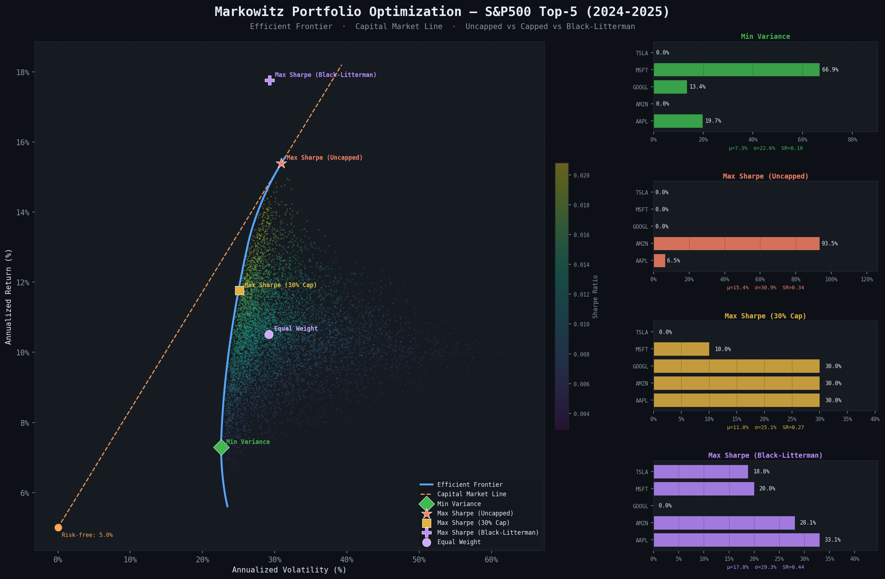
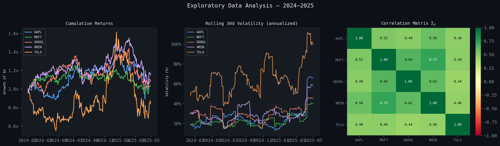
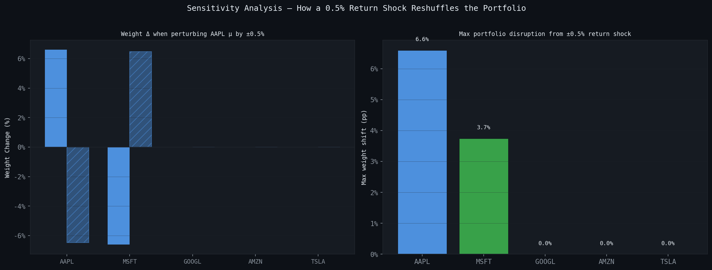

# Portfolio Optimization — Markowitz Mean-Variance Theory


Python implementation of Markowitz mean-variance optimization: efficient frontier, GMV and tangency portfolios, Monte Carlo feasible set, concentration-limited optimization, and Black-Litterman return blending — validated on real S&P 500 data (2024–2025).

## Table of Contents

- [Results](#results-real-data--sp-500-top-5-jan-2024--apr-2025-332-trading-days)
- [Exploratory Data Analysis](#exploratory-data-analysis)
- [Mathematical Foundation](#mathematical-foundation)
- [Markowitz Instability](#markowitz-instability)
- [Project Structure](#project-structure)
- [Usage](#usage)
- [API](#api)
- [Implementation Notes](#implementation-notes)
- [Linear Algebra Concepts](#linear-algebra-concepts)
- [Limitations](#limitations)
- [References](#references)



---

## Results (Real Data — S&P 500 Top-5, Jan 2024 – Apr 2025, 332 trading days)

| Portfolio | Annual Return | Volatility | Sharpe | Largest Position |
|-----------|--------------|------------|--------|-------------------|
| Min Variance | 7.3% | 22.6% | 0.10 | 66.9% MSFT |
| Max Sharpe — Uncapped | 15.4% | 30.9% | 0.34 | 93.5% AMZN |
| Max Sharpe — 30% Cap | 11.8% | 25.1% | 0.27 | 30.0% (AAPL/AMZN/GOOGL tied) |
| Max Sharpe — Black-Litterman | 17.8% | 29.3% | **0.44** | 33.1% AAPL |
| Equal Weight | 10.5% | 29.2% | 0.19 | 20.0% each |

Risk-free rate: 5.0% (US T-bill). Solver: `scipy.optimize.minimize` SLSQP.

**The uncapped tangency portfolio puts 93.5% of capital in a single stock (AMZN)** — the textbook Markowitz overconcentration problem (Michaud, 1989). Two standard fixes are compared here:

- **Hard cap** (`max_weight=0.30`): forces diversification mechanically. Sharpe drops from 0.34 → 0.27 — the cost of the constraint.
- **Black-Litterman**: blends a market-cap-implied equilibrium prior with one investor view ("MSFT will outperform GOOGL by 2% annually") instead of trusting the raw sample mean. Result: Sharpe actually *improves* to 0.44, spread across 4 of 5 assets, with no hard constraint needed — because the instability mostly came from noisy input estimates, not from the optimization itself.

> **Note on a labeling bug in earlier results:** an earlier version of this README/chart had the Min-Variance and Max-Sharpe weight labels swapped between MSFT and AMZN, caused by `yfinance.download()` returning columns alphabetically (`AAPL, AMZN, GOOGL, MSFT, TSLA`) while the notebook's `TICKERS` list was ordered `AAPL, MSFT, GOOGL, AMZN, TSLA`. The portfolio return/risk/Sharpe numbers were always correct — only the asset labels on two of the five bars were crossed. Fixed here; `portfolio_optimizer.py` was never affected since it labels weights from `returns.columns` directly.

---

## Exploratory Data Analysis



TSLA stands out with markedly higher rolling volatility throughout the sample (40–100%+ annualized, versus 20–40% for the other four), which is exactly why the optimizer assigns it near-zero weight in every variance-minimizing portfolio below. The correlation matrix (Σᵢⱼ, off-diagonal) shows all five assets positively correlated (0.44–0.73) — there is no negatively-correlated pair to hedge against, which is part of why diversification benefits are limited and the optimizer tends to concentrate in whichever single asset has the best risk-adjusted historical return.

---

## Mathematical Foundation

### Setup

Given $n$ assets and $T$ observations, we estimate:

$$\mu = \frac{1}{T} R^\top \mathbf{1} \in \mathbb{R}^n \qquad \Sigma = \frac{1}{T-1}(R - \mathbf{1}\mu^\top)^\top(R - \mathbf{1}\mu^\top) \in \mathbb{R}^{n \times n}$$

$\Sigma$ is symmetric positive semi-definite: $\forall w,\ w^\top \Sigma w \geq 0$.

### Portfolio Statistics

| Quantity | Formula |
|---|---|
| Expected return | $\mu_p = w^\top \mu$ |
| Variance | $\sigma_p^2 = w^\top \Sigma w$ |
| Sharpe ratio | $S = (\mu_p - r_f) / \sigma_p$ |

### Optimization Problems

**Minimum Variance** (for target return $r^*$):

$$\min_{w}\ w^\top \Sigma w \quad \text{s.t.}\ w^\top \mu = r^*,\ \mathbf{1}^\top w = 1,\ w \geq 0$$

Quadratic program; solved numerically via SLSQP.

**Global Minimum Variance** — closed-form (unconstrained):

$$w^*_{GMV} = \frac{\Sigma^{-1}\mathbf{1}}{\mathbf{1}^\top \Sigma^{-1} \mathbf{1}}$$

Derived from Lagrangian $\mathcal{L} = w^\top \Sigma w - \lambda(\mathbf{1}^\top w - 1)$; FOC gives $2\Sigma w = \lambda \mathbf{1}$, normalized by $\mathbf{1}^\top w = 1$.

**Tangency Portfolio (Max Sharpe)** — closed-form (unconstrained):

$$w^*_{tan} \propto \Sigma^{-1}(\mu - r_f \mathbf{1})$$

Tangent point of the Capital Market Line to the efficient frontier:

$$\mu_p = r_f + \frac{\mu_{tan} - r_f}{\sigma_{tan}} \cdot \sigma_p$$

### Efficient Frontier

Solving the min-variance QP across $r^* \in [\mu_{min},\ \mu_{max}]$ traces the efficient frontier — a **hyperbola** in $(\sigma, \mu)$ space. The 8,000-point Monte Carlo cloud (Dirichlet-sampled) visualises the full feasible set.

### Two-Fund Separation

Any efficient portfolio is a linear combination of GMV and tangency:

$$w^* = \alpha\, w_{GMV} + (1-\alpha)\, w_{tan}, \qquad \alpha \in \mathbb{R}$$

### Sensitivity Analysis

A 0.5% annual change in expected returns — well within normal estimation error — completely reshuffles the optimal weights. Perturbing AAPL's μ alone by ±0.5% shifts AAPL's own weight by 6.6pp and MSFT's by 3.7pp in the opposite direction, while GOOGL, AMZN, and TSLA stay untouched at 0% — the perturbation only moves capital between the two assets the optimizer was already close to indifferent between.



See [Markowitz Instability](#markowitz-instability) below for how this same instability plays out across the full tangency portfolio, and how Black-Litterman addresses it.

---

## Markowitz Instability

The optimizer is hyper-sensitive to input estimates. On real S&P 500 data:

- **Min Variance**: 66.9% MSFT, 19.7% AAPL, 13.4% GOOGL
- **Max Sharpe (uncapped)**: 93.5% AMZN, 6.5% AAPL

A 0.5% perturbation in $\mu$ produces 50pp+ weight reallocation — replicating Michaud (1989). This is estimation error amplification, not a solver bug.

### Two Fixes, Compared

**1. Hard weight cap** — `MarkowitzOptimizer(returns, max_weight=0.30)` adds $w_i \leq 0.30\ \forall i$ to every numerical solve. Mechanical, easy to explain, but costs Sharpe ratio (0.34 → 0.27 here) because it can bind even when the optimizer's underlying signal is directionally correct.

**2. Black-Litterman** — instead of constraining the *weights*, stabilize the *input*. Rather than trusting the noisy sample mean $\mu$ directly, blend a market-cap-implied equilibrium prior $\Pi$ with explicit investor views:

$$E[R]_{BL} = \left[(\tau\Sigma)^{-1} + P^\top\Omega^{-1}P\right]^{-1}\left[(\tau\Sigma)^{-1}\Pi + P^\top\Omega^{-1}Q\right]$$

where $\Pi = \delta\,\Sigma\, w_{mkt}$ (reverse-optimized from market-cap weights $w_{mkt}$), $P$/$Q$ encode the investor's views, $\Omega$ is view uncertainty (He-Litterman convention by default), and $\tau$ controls prior uncertainty.

Implemented in `black_litterman_posterior()`. With market caps as of Dec 29, 2023 (AAPL $2.99T, MSFT $2.79T, GOOGL $1.75T, AMZN $1.57T, TSLA $0.79T — [stockanalysis.com](https://stockanalysis.com)) and a single relative view ("MSFT will outperform GOOGL by 2% annually" — illustrative, not a forecast claim), the resulting tangency portfolio spreads across AAPL/AMZN/MSFT/TSLA and **improves** the Sharpe ratio to 0.44 versus 0.34 uncapped — no hard constraint required.

The long-only constraint ($w \geq 0$) and the 30% concentration cap are both implemented; Black-Litterman is the more principled fix since it addresses *why* the optimizer is unstable (noisy $\mu$) rather than just capping the symptom.

---

## Project Structure

```
portfolio-optimization/
├── portfolio_optimizer.py    — MarkowitzOptimizer class (GMV, Tangency, Frontier, Caps, Black-Litterman)
├── visualize.py               — Efficient frontier dashboard (Matplotlib): GMV/Uncapped/Capped/BL
├── analysis.ipynb              — Real data analysis (yfinance, S&P 500 2024–2025); generates EDA and sensitivity figures
├── returns.csv                 — Exported daily log returns (from analysis.ipynb)
├── efficient_frontier.png      — Synthetic data output
├── efficient_frontier_real.png — Real market data output (4-portfolio dashboard)
├── output.png                  — EDA: cumulative returns, rolling volatility, correlation matrix
├── sensitivity_analysis.png    — Weight sensitivity to a 0.5% return shock
└── requirements.txt
```

---

## Usage

```python
import numpy as np
import pandas as pd
from portfolio_optimizer import MarkowitzOptimizer

# Daily returns DataFrame (rows = dates, columns = tickers)
returns = pd.read_csv("returns.csv", index_col=0)

opt = MarkowitzOptimizer(returns, risk_free_rate=0.05/252)

gmv      = opt.global_minimum_variance()   # Min variance
tangency = opt.maximize_sharpe()           # Max Sharpe (uncapped)
frontier = opt.efficient_frontier(n_points=300)

# Concentration cap: same API, capped optimizer
opt_capped     = MarkowitzOptimizer(returns, risk_free_rate=0.05/252, max_weight=0.30)
tangency_cap   = opt_capped.maximize_sharpe()

# Black-Litterman: blend market-implied prior with a view, then optimize on the posterior
market_caps = np.array([2990.0, 1570.0, 1750.0, 2790.0, 789.9])  # AAPL AMZN GOOGL MSFT TSLA, $B
P = np.array([[0, 0, -1, 1, 0]])    # view: MSFT - GOOGL
Q = np.array([0.02 / 252])          # "MSFT outperforms GOOGL by 2%/yr"
bl_mu        = opt.black_litterman_posterior(market_caps=market_caps, P=P, Q=Q)
tangency_bl  = opt.maximize_sharpe(mu=bl_mu)
```

```bash
python visualize.py   # generates efficient_frontier_real.png (GMV / uncapped / capped / BL dashboard)
```

---

## API

### `MarkowitzOptimizer(returns, risk_free_rate=0.02, max_weight=None)`

| Method | Description |
|---|---|
| `minimize_variance(target_return, long_only, mu)` | Min-variance QP for given $r^*$ |
| `maximize_sharpe(long_only, mu)` | Tangency portfolio |
| `global_minimum_variance(long_only)` | GMV portfolio |
| `efficient_frontier(n_points, long_only, mu)` | Full frontier (DataFrame) |
| `portfolio_return(w, mu)` | $w^\top \mu$ |
| `portfolio_volatility(w)` | $\sqrt{w^\top \Sigma w}$ |
| `sharpe_ratio(w, mu)` | $(w^\top\mu - r_f)/\sigma_p$ |
| `black_litterman_posterior(market_caps, P, Q, tau, view_confidence, delta)` | Posterior $E[R]_{BL}$, pass into `mu=` of any method above |

`max_weight` (constructor arg, optional): caps every asset at `w_i ≤ max_weight` in all numerical solves. Raises if infeasible (`max_weight * n_assets < 1`).

### `monte_carlo_portfolios(optimizer, n_simulations=10_000)`

Samples random portfolios from $\text{Dirichlet}(\mathbf{1})$ for feasible set visualization.

---

## Implementation Notes

| Detail | Choice |
|---|---|
| Solver | `scipy.optimize.minimize`, `method="SLSQP"` |
| Covariance | Sample covariance matrix |
| Stability | `numpy.linalg.pinv` (pseudoinverse) for near-singular $\Sigma$ |
| Long-only | $w_i \geq 0\ \forall i$ (toggleable) |
| Monte Carlo | $\text{Dirichlet}(\mathbf{1})$ ensures $w_i > 0$, $\sum w_i = 1$ |

---

## Linear Algebra Concepts

| Concept | Role in Implementation |
|---|---|
| Positive semi-definite matrix | $\Sigma$ validity check: $w^\top \Sigma w \geq 0$ |
| Pseudoinverse | Closed-form GMV and tangency under near-singularity |
| Cholesky decomposition | Correlated return simulation: $R = ZL^\top$, $\Sigma = LL^\top$ |
| Quadratic form | Portfolio variance $\sigma_p^2 = w^\top \Sigma w$ |
| KKT conditions | Optimality conditions for the constrained QP |
| Lagrange multipliers | Closed-form derivation of GMV and tangency |

---

## Limitations

- Sample mean $\mu$ over a single 16-month window is a noisy estimator — exactly the problem this README's Markowitz Instability and Black-Litterman sections address, not an oversight
- 5 highly-correlated US mega-cap tech stocks is a narrow universe; diversification benefits shown here would not generalize to a broader, less-correlated asset set
- The Black-Litterman view used here ("MSFT will outperform GOOGL by 2% annually") is illustrative, chosen to demonstrate the mechanism — not a real forecast or trading recommendation
- Risk-free rate (5.0%) and market caps are point-in-time snapshots, not time-varying inputs
- Transaction costs, taxes, and rebalancing frequency are not modeled

---

## References

- Markowitz, H. (1952). *Portfolio Selection*. **Journal of Finance**, 7(1), 77–91.
- Michaud, R. (1989). *The Markowitz Optimization Enigma: Is Optimized Optimal?* **Financial Analysts Journal**.
- Merton, R. (1972). *An Analytic Derivation of the Efficient Portfolio Frontier*. **JFQA**.
- Black, F. & Litterman, R. (1992). *Global Portfolio Optimization*. **Financial Analysts Journal**, 48(5), 28–43.
- Idzorek, T. (2005). *A Step-by-Step Guide to the Black-Litterman Model*. Working paper.
- Boyd & Vandenberghe. *Convex Optimization*. Cambridge University Press (Ch. 4, 7).
